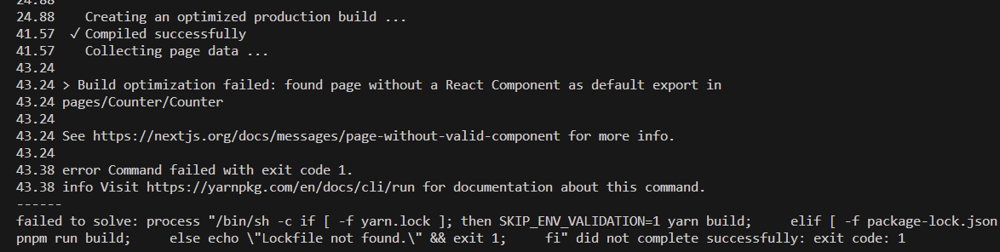

<h1 style="color:brown;">Errors & Solutions</h1>

<h2 style="color:#FFB302;">Eslint</h2>

<!-- Error 1 start  -->

1. 
<sapn>
<h3 style="color:#FF3838;">Build optimization failed: found page without a React Component as default export in pages/Counter/Counter</h3>

Open the file at pages/Counter/Counter and make sure that it exports a valid React component as its default export

</sapn>

 
<!-- Error 1 ends  -->

<h2 style="color:#FFB302;">Front-End</h2>

<h2 style="color:#FFB302;">Back-End</h2>

<h2 style="font-weight:bold; "> 
C 
O
L
O
R
S
</h2>
<!-- Critical, alert, form error, emergency, urgent --> 
<!-- Serious, error, warning, needs attention -->
<!-- Caution, unstable, unsatisfactory -->
<!-- Normal, on, ok, fine, go, satisfactory -->
<!-- Standby, available, enabled -->
<!-- Off, unavailable, disabled -->
